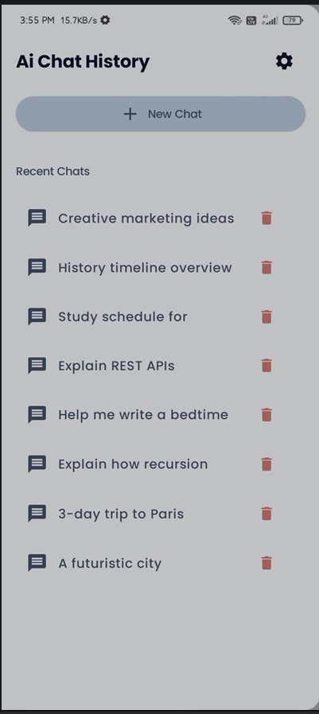
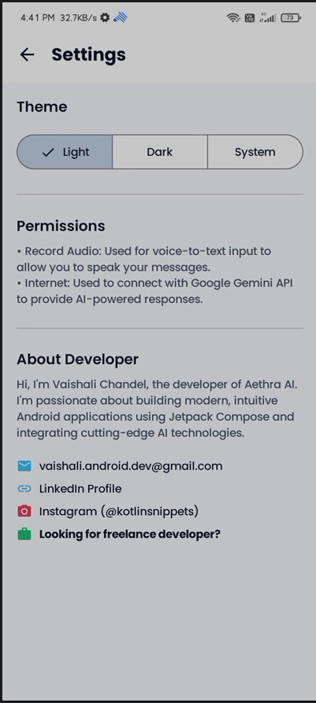
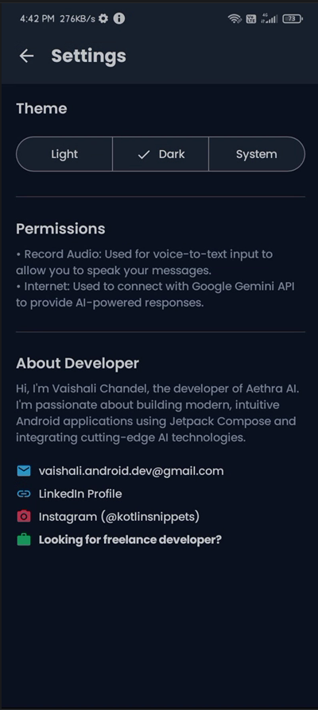
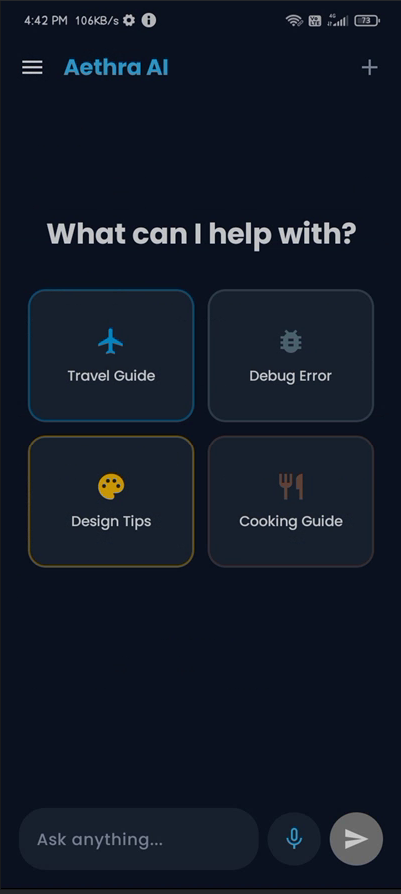
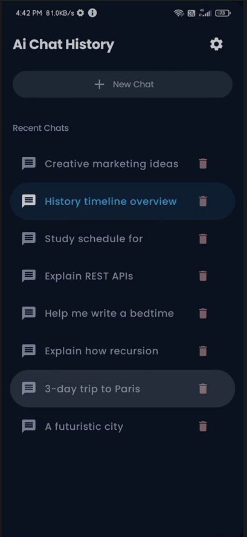

# Aethra AI - Your Intelligent Companion

Aethra AI is a modern, feature-rich Android chat application built with **Jetpack Compose** and powered by the **Google Gemini API**. It provides a fluid, intuitive interface for interacting with one of the most advanced AI models available.

## ✨ Features

- **AI-Powered Conversations:** Seamlessly chat with Gemini for writing, coding, brainstorming, and problem-solving.
- **Persistent Chat History:** Your conversations are automatically saved locally using **Room Database**, allowing you to pick up where you left off.
- **Voice-to-Text:** Input messages using your voice with built-in speech recognition support.
- **Smart Message Grouping:** Messages are automatically grouped by date for better readability.
- **Markdown Support:** Renders AI responses with rich formatting, including headers, code blocks, bold, and italics.
- **Chat Management:**
    - **Rename Chats:** Long-press on a chat in the history to give it a custom name.
    - **Delete Chats:** Easily remove old conversations with a dedicated delete button.
    - **Stop Generation:** Cancel an active AI response if you change your mind.
- **Customizable Themes:** Supports Light, Dark, and System default themes.
- **Modern UI:** Built entirely with Jetpack Compose, featuring smooth animations, Material 3 design, and responsive layouts.

## 🛠️ Tech Stack

- **UI:** [Jetpack Compose](https://developer.android.com/jetpack/compose) (Material 3)
- **Architecture:** MVVM (Model-View-ViewModel)
- **AI Engine:** [Google Generative AI SDK (Gemini)](https://ai.google.dev/)
- **Local Storage:** [Room Database](https://developer.android.com/training/data-storage/room)
- **Dependency Management:** Kotlin DSL (Gradle)
- **Asynchronous Programming:** Kotlin Coroutines & Flow
- **Preferences:** DataStore (for theme settings)

## 🚀 Getting Started

### Prerequisites

- Android Studio Ladybug (or newer)
- A Gemini API Key from [Google AI Studio](https://aistudio.google.com/)

### Setup

1. **Clone the repository:**
   ```bash
   git clone https://github.com/vaishaliichandel/AiChat.git
   ```

2. **Add your API Key:**
   Open your `gradle.properties` file in the root directory and add your Gemini API key:
   ```properties
   GEMINI_API_KEY=your_actual_api_key_here
   ```

3. **Build and Run:**
   Sync Gradle and run the app on your Android device or emulator.

## 📸 Screenshots

*        *

## 📝 License

This project is licensed under the MIT License - see the [LICENSE](LICENSE) file for details.

---
*Developed with ❤️ using Jetpack Compose.*
